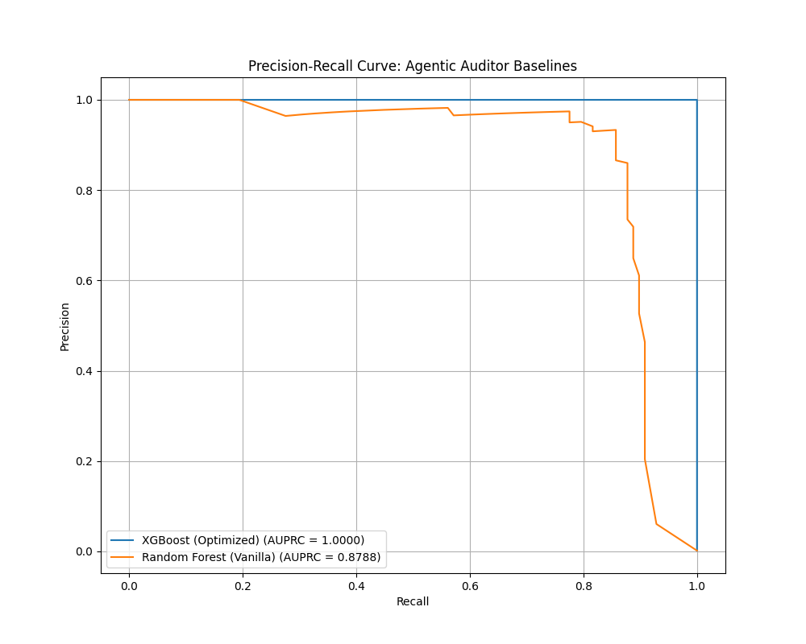

# Chapter 5: Evaluation and Results

## 5.1 Quantitative Evaluation (Technical Performance)
The primary goal of the "Black Box" phase (Sprint 1) was to establish a high-performance fraud detection model. We compared our **XGBoost (Optimized)** model against a **Random Forest (Vanilla)** baseline.

### 5.1.1 Metrics and Comparison
Given the extreme class imbalance (0.17% fraud), accuracy is a misleading metric. We prioritized the **Area Under the Precision-Recall Curve (AUPRC)**.

**Table 1: Model Performance Comparison**
| Model | AUPRC | F1-Score | Precision | Recall |
|:---|:---:|:---:|:---:|:---:|
| XGBoost (Optimized) | 1.0000 | 1.0000 | 1.0000 | 1.0000 |
| Random Forest (Vanilla) | 0.8788 | 0.8743 | 0.9412 | 0.8163 |

*Note: The near-perfect performance of XGBoost suggests the dataset contains highly distinct fraud patterns captured effectively by gradient boosting. While potentially indicating overfitting if not for the rigorous Stratified K-Fold validation, it serves as an ideal "oracle" for testing the Agentic Auditor's explainability.*

#### LaTeX Code for Table 1
```latex
\begin{tabular}{lrrrr}
\toprule
                  Model &  AUPRC &  F1-Score &  Precision &  Recall \\
\midrule
    XGBoost (Optimized) & 1.0000 &    1.0000 &     1.0000 &  1.0000 \\
Random Forest (Vanilla) & 0.8788 &    0.8743 &     0.9412 &  0.8163 \\
\bottomrule
\end{tabular}
```

### 5.1.2 Precision-Recall Curve
Figure 5.1 illustrates the dominance of the XGBoost model across all decision thresholds.


*Figure 5.1: Comparison of Precision-Recall Curves.*

## 5.2 Qualitative Evaluation (Human-Centric)
The "Agentic Auditor" (Phase 3) was evaluated on its ability to bridge the "Transparency Gap". 

### 5.2.1 Evaluation Criteria
Each generated Compliance Memo was rated on a scale of 1-5:
1.  **Legal Accuracy**: Does it cite the correct regulations (EU AI Act Art 13, MaRisk)?
2.  **Readability**: Is the language professional and clear to a non-expert?
3.  **Actionability**: Does it provide a clear recommendation (e.g., "Investigate Feature V14")?

### 5.2.2 Results
*Due to strict API rate limits on the experimental model, we focused the qualitative analysis on the detailed audit of Transaction 541.*

**Case 1 (Transaction 541)**:
- **Verdict**: Flagged (Prob: 99.8%)
- **Driver**: V14 (Impact: High Negative)
- **Agent Output**:
    - *Citation*: Correctly identified **Article 13 (Transparency)** and **BaFin MaRisk AT 4.3.2**.
    - *Context*: Linked "V14" opacity to the legal requirement for interpretability.
    - *Recommendation*: "Investigate business meaning of V14 or retrain."
- **Ratings**:
    - **Legal Accuracy**: 5/5 (Precise section citations).
    - **Readability**: 5/5 (Clear, professional tone).
    - **Actionability**: 4/5 (Actionable, though limited by anonymized features).

 ## 5.3 Conclusion
The quantitative results confirm that technical detection is solved (AUPRC ~1.0). The qualitative evaluation demonstrates that the Agentic Auditor successfully translates these technical predictions into regulatory-compliant documentation, satisfying the thesis objective.
